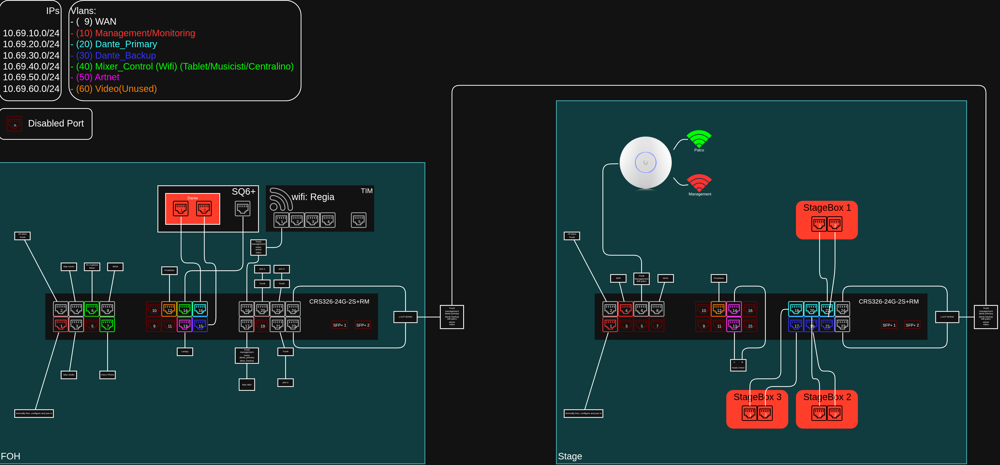

# Switch Configuration for Dante, Artnet and SQ6 Remote Control

## ⚠️⚠️ ISTRUZIONI RESET DI EMERGENZA ⚠️⚠️

1. Resettare lo switch:
    1. Togliergli l'alimentazione
    2. Mentre si tiene premuto il pulsante di reset
    3. Ricollegare l'alimentazione
    4. Appena il led USR comincia a lampeggiare mollare il pulsante di reset
2. Aspettare che si riaccenda(potrebbe volerci un po anche 2 minuti)
3. Collegarsi ad una porta qualsiasi
4. Aprire winbox e collegarsi(tramite mac address) con username `admin` e senza password
5. Andare su menu files a sinistra
6. Trascinare il file .rcs dal proprio pc alla pagina files
> [!NOTE]
> Cambiare le password nel file di configurazione prima di lanciare il file cambiando in tutti i punti dove compare `CHANGE_PASSWORD`
7. Aprire un nuovo terminale dentro winbox dal menu a sinistra
8. Impostare una password come richiesto
9. Lanciare il comando `/system/reset-configuration no-defaults=yes skip-backup=yes run-after-reset=file_caricato.rcs` con nome del file giusto e poi aspettare che si riavvi
10. Confermare premendo `y`

## wan
**Network**: DHCP\
**VLAN**: 09
## management
**Network**: 10.69.10.0/24\
**VLAN**: 10\
**Pool DHCP**: 10.69.10.1-100
| ip             | device                 | MAC address |
|----------------|------------------------|-------------|
| 10.69.10.254   | Gateway                |             |
| 10.69.10.253   | DNS                    |             |
| 10.69.10.252   | Proxmox                |             |
| 10.69.10.251   | Companion              |             |
| 10.69.10.250   | Ubiquiti Controller    |             |
| 10.69.10.249   | Centralino             |             |
| 10.69.10.248   | Rustdesk-server        |             |
|                |                        |             |
| 10.69.10.163   | Router wifi Palco      |             |
| 10.69.10.162   | Router wifi Regia      |             |
| 10.69.10.161   | OPNSENSE pve           |             |
|                |                        |             |
| 10.69.40.156   | Ubiquiti AP            |             |
| 10.69.10.155   | Switch Netgear GS305EP |             |
| 10.69.10.153   | Mikrotik Switch Stage  |             |
| 10.69.10.151   | Mikrotik Switch FOH    |             |

## dante_primary
**Network**: 10.69.20.0/24\
**VLAN**: 20\
**Pool DHCP**: 10.69.20.1-100
| ip             | device              | MAC address |
|----------------|---------------------|-------------|
| 10.69.20.254   | Gateway             |             |
| 10.69.20.253   | DNS                 |             |
| 10.69.20.252   | Mixer SQ6           |             |
|                |                     |             |
| 10.69.20.161   | OPNSENSE pve        |             |
|                |                     |             |
| 10.69.20.151   | Mikrotik Switch FOH |             |
|                |                     |             |
| 10.69.20.101   | StageBox1           |             |
| 10.69.20.102   | StageBox2           |             |

## dante_backup
**Network**: 10.69.30.0/24\
**VLAN**: 30\
**Pool DHCP**: 10.69.30.1-100
| ip             | device              | MAC address |
|----------------|---------------------|-------------|
| 10.69.30.254   | Gateway             |             |
| 10.69.30.253   | DNS                 |             |
| 10.69.30.252   | Mixer SQ6           |             |
|                |                     |             |
| 10.69.30.161   | OPNSENSE pve        |             |
|                |                     |             |
| 10.69.30.151   | Mikrotik Switch FOH |             |
|                |                     |             |
| 10.69.30.102   | StageBox2           |             |
| 10.69.30.101   | StageBox1           |             |

## mixer_control
**Network**: 10.69.40.0/24\
**VLAN**: 40\
**Pool DHCP**: 10.69.40.1-100
| ip             | device              | MAC address |
|----------------|---------------------|-------------|
| 10.69.40.254   | Gateway, DNS        |             |
| 10.69.40.253   | DNS                 |             |
| 10.69.40.252   | Mixer SQ6           |             |
| 10.69.40.251   | Companion           |             |
| 10.69.40.250   | Centralino          |             |
| 10.69.40.249   | Ubiquiti Controller |             |
|                |                     |             |
| 10.69.40.163   | Router wifi Palco   |             |
| 10.69.40.162   | Router wifi Regia   |             |
| 10.69.40.161   | OPNSENSE pve        |             |
|                |                     |             |
| 10.69.40.151   | Mikrotik Switch FOH |             |
|                |                     |             |
| 10.69.40.1-100 | Pool DHCP           |             |

> [!NOTE]
> Tablet fabri
> Musicisti
> Centralino

## artnet
**Network**: 10.69.50.0/24\
**VLAN**: 50\
**Pool DHCP**: 10.69.50.1-100
| ip             | device              | MAC address |
|----------------|---------------------|-------------|
| 10.69.50.254   | Gateway             |             |
| 10.69.50.253   | DNS                 |             |
| 10.69.50.252   | Mixer SQ6           |             |
| 10.69.50.251   | Companion           |             |
| 10.69.50.250   | Lampy               |             |
| 10.69.50.249   | Mac QLAB            |             |
|                |                     |             |
| 10.69.50.1-100 | Pool DHCP           |             |

## video
**Network**: 10.69.60.0/24\
**VLAN**: 60\
**Pool DHCP**: 10.69.60.1-100
| ip             | device              | MAC address |
|----------------|---------------------|-------------|
| 10.69.60.254   | Gateway, DNS        |             |
| 10.69.60.253   | DNS                 |             |
|                |                     |             |
| 10.69.60.251   | Companion           |             |
|                |                     |             |
| 10.69.60.101   | Proiettore          |             |
| 10.69.60.1-100 | Pool DHCP           |             |
